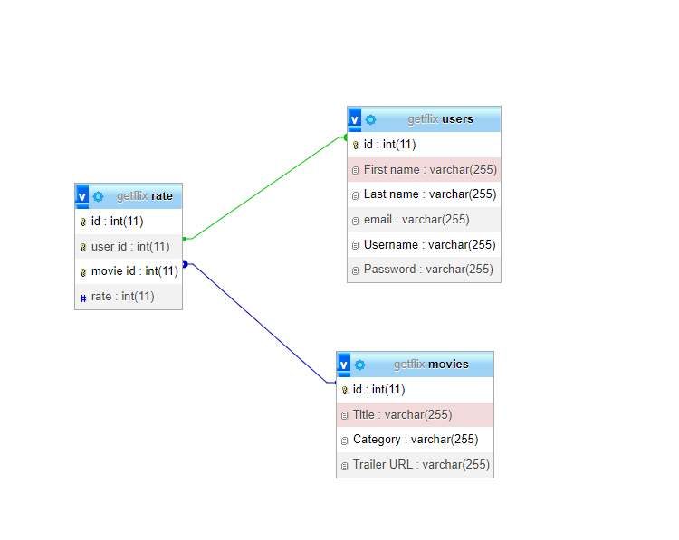

# Film Frenzy, streaming app; 

-----------------------------

## L'équipe : 

- Sebastien
- Laurent
- Maxime
- Kim

## description du projêt : 

- streaming platform pour vous et vos ami(e)s;

## techs :

- [front-end] : React, Typescript, Framer, Tailwind;

- [back-end] : nodeJs, mysql, PHP, Express.JS, JS web tokens;

## schéma du DB :

## doc général du projêt :

- Deliverables : User Story

Create streaming site inspired (Netflix, Hulu, Paramount+, Disney +, HBO max, Apple TV+, Amazon)

1. User Story: As an User I want to connect  to a streaming service
    - [ ] Landing
    - [ ] Sign up 
    - [ ] Login
    - [ ] Forget Password
        - [ ] Mail system - Mailchimp
    - [ ] Reset Password

2. User Story: As an user I want to view films
    - [ ] Interact with public api and populate db
    - [ ] Movies show all 
    - [ ] Movies show one

3. User Story: As an user I want to search for films and filter my search
    - [ ]  Search movies by title, mots clés 
    - [ ] Filter Movie by 
        - [ ] Label
        - [ ] categorie

4. User Story:  As an user I  want to rate the films I watch
    - [ ] Rating System on Movie show one



5. User Story: As an user I want to pay for my subscription
    - [ ] Payment System ?? (Stripe, ou des autres)
    - [ ] Product/Subscription has price

6. User Story: As an User I want to be inform of the of site's data, privacy  and cookie policy
    - [ ] Privacy Policy
    - [ ] Cookie Policy
    - [ ] Terms of Service

7. User Story: As an admin I want to manage films,  ratings, commentaries via a backoffice panel
    - [ ]  Backoffice system ??
        - [ ] Commentaire
        - [ ] Raitings
            - [ ] Filtre par 
    - [ ] Films
        - [ ] all
        - [ ] show one

8. Other
    - [ ] Comment System on Movie show one ?

Technologies to use 
    - Frontend: React, PHP, ...other
    - Backend: NodeJs, PHP, Java, …etc
    - PHP Laravel || Symphony

## sources : 

- tailwind components : https://tailwind-elements.com/

